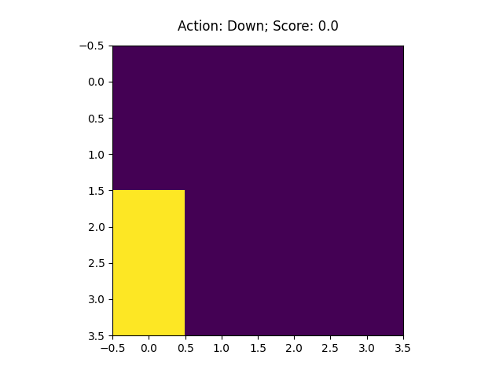

# 2048-reinforcement-learning

Playing the game 2048 with deep reinfocement learning agents

The logic behind 2048 is based on the code of [GeekForGeeks](https://www.geeksforgeeks.org/2048-game-in-python/).

